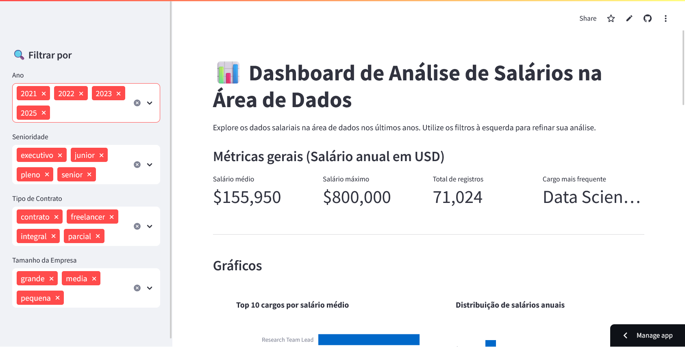

# 📊 Dashboard de Análise de Salários na Área de Dados

Um dashboard interativo construído com Python e Streamlit para explorar e analisar dados de salários no campo de Data Science, baseado em dados coletados nos últimos anos.


---

### 🚀 Visão Geral

Este projeto apresenta um dashboard que permite a visualização e filtragem de informações salariais de profissionais da área de dados. Os usuários podem interagir com os filtros para refinar a análise e obter insights sobre remuneração, considerando fatores como ano, nível de senioridade, tipo de contrato e tamanho da empresa.

### ✨ Funcionalidades

- **Métricas Dinâmicas:** KPIs que mostram o salário médio, salário máximo e o total de registros com base nos filtros aplicados.
- **Filtros Interativos:**
  - Ano
  - Nível de Senioridade
  - Tipo de Contrato (CLT, PJ)
  - Tamanho da Empresa
- **Gráficos Detalhados:**
  - **Top 10 Cargos por Salário Médio:** Um gráfico de barras horizontais com os cargos mais bem pagos.
  - **Distribuição Salarial:** Um histograma para visualizar a frequência das faixas salariais.
  - **Proporção de Tipos de Trabalho:** Um gráfico de pizza mostrando a distribuição entre trabalho remoto, presencial e híbrido.
  - **Salário de Cientista de Dados por País:** Um mapa coroplético que exibe a média salarial para a posição de *Data Scientist* globalmente.
- **Tabela de Dados:** Exibição dos dados brutos filtrados para uma análise mais aprofundada.

### 🛠️ Tecnologias Utilizadas

- **Python:** Linguagem principal do projeto.
- **Streamlit:** Framework para a construção do dashboard interativo.
- **Pandas:** Para manipulação e análise dos dados.
- **Plotly:** Para a criação dos gráficos interativos.

### ⚙️ Como Executar Localmente

1.  **Clone o repositório:**
    ```bash
    git clone https://github.com/emellydev/imersao-dados-python-alura.git
    cd imersao-dados-python-alura
    ```

2.  **Crie um ambiente virtual (recomendado):**
    ```bash
    python -m venv .venv
    source .venv/bin/activate  # No Windows, use: .venv\Scripts\activate
    ```

3.  **Instale as dependências:**
    ```bash
    pip install -r requirements.txt
    ```

4.  **Execute o aplicativo Streamlit:**
    ```bash
    streamlit run app.py
    ```

---

## 🇺🇸 English Version

### 🚀 Overview

This project features a dashboard that allows users to visualize and filter salary information for data professionals. Users can interact with filters to refine their analysis and gain insights into compensation, considering factors like year, seniority level, contract type, and company size.


### ✨ Features

- **Dynamic Metrics:** KPIs showing the average salary, maximum salary, and total records based on the applied filters.
- **Interactive Filters:**
  - Year
  - Seniority Level
  - Contract Type
  - Company Size
- **Detailed Charts:**
  - **Top 10 Job Titles by Average Salary:** A horizontal bar chart with the highest-paying positions.
  - **Salary Distribution:** A histogram to visualize the frequency of salary ranges.
  - **Work Type Proportion:** A pie chart showing the distribution between remote, in-person, and hybrid work.
  - **Data Scientist Salary by Country:** A choropleth map displaying the average salary for the *Data Scientist* position globally.
- **Data Table:** Display of the filtered raw data for deeper analysis.

### 🛠️ Technologies Used

- **Python:** The core language of the project.
- **Streamlit:** Framework for building the interactive dashboard.
- **Pandas:** For data manipulation and analysis.
- **Plotly:** For creating interactive charts.

### ⚙️ How to Run Locally

Follow the same steps described in the Portuguese version above. The commands are universal.